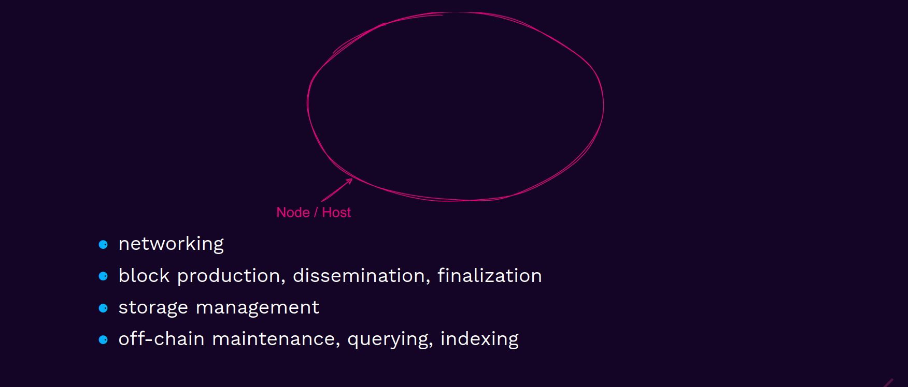
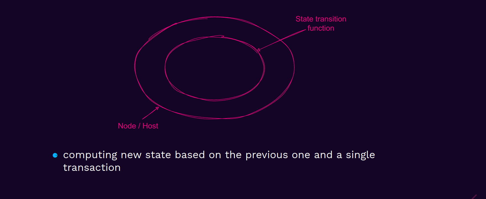
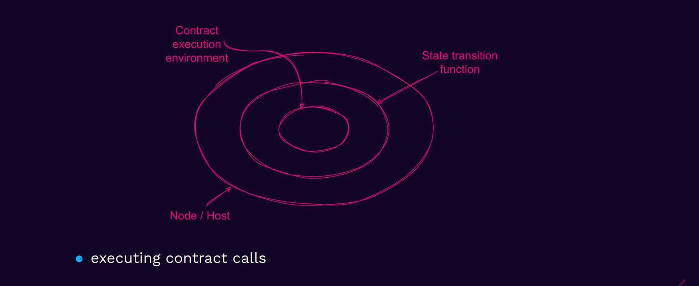
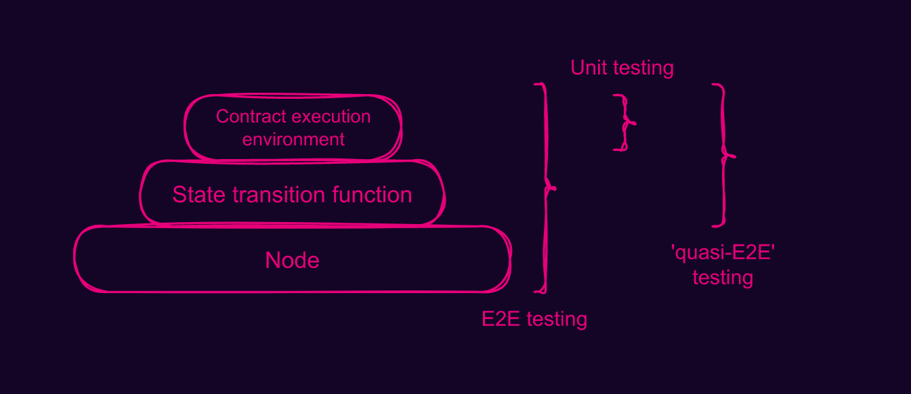

# Testing strategies for ink! smart contracts

In this directory you can find a collection of three main testing strategies for ink! smart contracts.
We present them in the context of the Squink-Splash game.

## Code organization

We will be testing a simple player strategy for the Squink-Splash game.
Our player's contract can be found in the [my-player](./my-player) directory.
There, you will also find all the tests.

In order to test our strategy in a full game simulation against other players, we also include two other simple players:
 - [random-player](./rand-player) - a player that makes random moves
 - [corner-player](./corner-player) - a player that starts painting in the right bottom corner of the board and then moves towards the left top corner

## Running tests

In order to run the tests, you need to have `cargo-contract` and `substrate-contracts-node` installed.
You can do that by running:
```bash
cargo install cargo-contract
cargo install contracts-node
```

Then, you can run the tests by executing:
```bash
cd my-player/

# run unit tests (optionally without the `--release` flag)
cargo test --features unit-tests --release

# run e2e tests (optionally without the `--release` flag)
cargo test --features e2e-tests --release

# run quasi-e2e tests (optionally without the `--release` flag)
./build_contracts.sh && cargo test --features drink-tests --release

# run a single testcase code using two different testing strategies (optionally without `--release` flag)
cargo test --features switching-strategies --release
```

_Note: We for the quasi-e2e tests, we need to build the contracts manually.
For other tests, `cargo test` will do that for us, but will also remove `json` metadata files, which are needed for the drink! framework._

---

## Testing strategies

There are three primary paradigms for testing ink! smart contracts:
 - [Unit testing](./my-player/src/unit_tests.rs)
 - [End-to-End testing](./my-player/src/e2e_tests.rs)
 - ['quasi-End-to-End' testing](./my-player/src/drink_tests.rs)

The best way to understand the differences between them is to look at the technology stack, that they are touching.

### Smart contract execution onion

When we submit a contract call (or instantiation) to a blockchain, our transaction goes through a few layers.
Firstly, it will be delivered to some validator's node binary.



Then, we will try to execute the transaction in order to compute new updated state.
For this, a transition function (runtime) will be spawned as an auxiliary procedure.


Since the transaction was targeting some smart contract (in opposite to a 'predefined' runtime API like a token transfer), we must spawn yet another environment specially for the contract execution.


While the situation is a bit complex, we have very clear boundaries between the layers.
This allows us to design different effective testing strategies for various segments of the stack that we would like to interact with.

