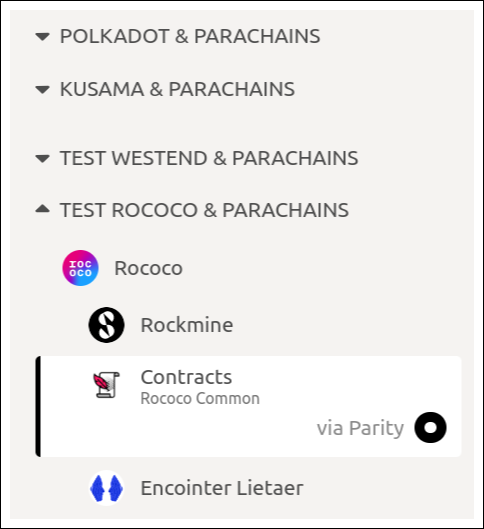
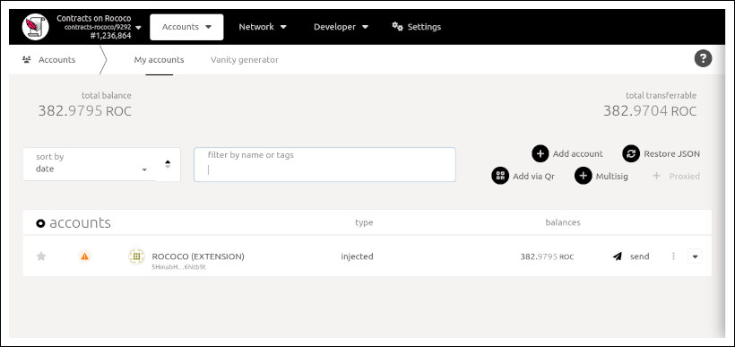
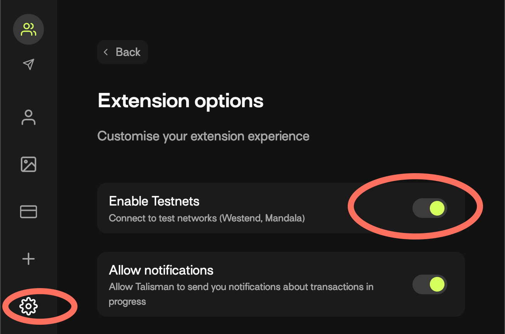

# Workshop Preparations

## Browser Extension

* Talisman: [Firefox](https://addons.mozilla.org/en-US/firefox/addon/talisman-wallet-extension/?utm_source=addons.mozilla.org&utm_medium=referral&utm_content=search) / [Chrome](https://chrome.google.com/webstore/detail/talisman-polkadot-wallet/fijngjgcjhjmmpcmkeiomlglpeiijkld?hl=en).
* The [`polkadot-js` browser extension](https://polkadot.js.org/extension/)

In the extension: set up a test account for the Contracts parachain on Rococo.
You can find the parachain [here](https://polkadot.js.org/apps/#/explorer):

This is how your "Accounts" tab should look (minus the funds):

Note: If you are using Talisman you must turn on "Enable Testnets" inside of settings.

## Get Testnet Funds

1. Visit the Rococo faucet [matrix channel](https://matrix.to/#/#rococo-faucet:matrix.org).

2. Use the command `!drip YOUR_WALLET_ADDRESS:1002`. (Note the `:1002` on the end indicates that the funds are teleported to our Contracts parachain on Rococo).

Guided instructions can be found [here](https://use.ink/testnet).

## Install `cargo-contract` `master`

In addition to Rust, the installation requires a C++ compiler that supports C++17.
Modern releases of gcc and clang, as well as Visual Studio 2019+ should work.

1. `rustup default stable`
1. `rustup component add rust-src`.
1. `cargo install --force --git https://github.com/paritytech/cargo-contract.git`.
1. Verify the version is `2^`: `cargo-contract --version`.

## Need help?
Message the ink! team in [Parity Smart Contracts [internal]](https://matrix.to/#/!nqwrcufvSwqTNsLMkj:matrix.parity.io?via=matrix.parity.io&via=web3.foundation).
