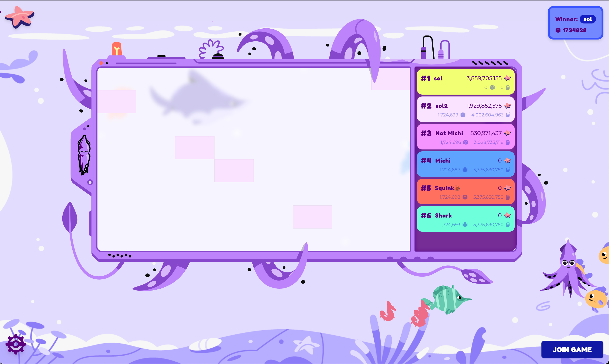
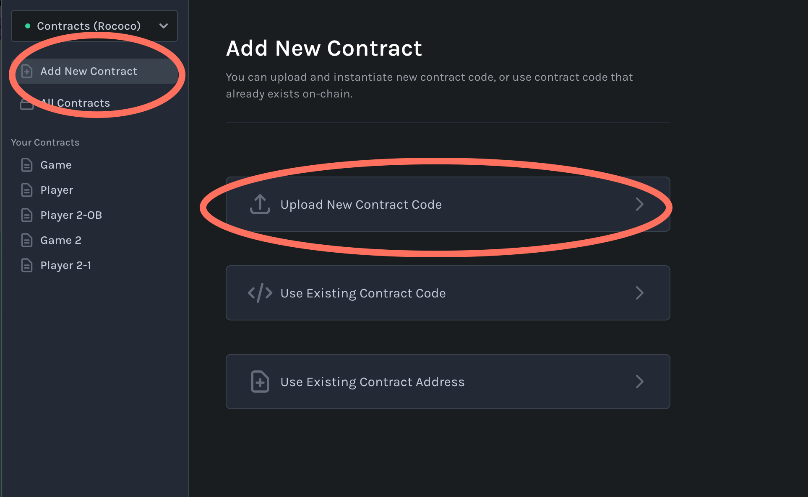
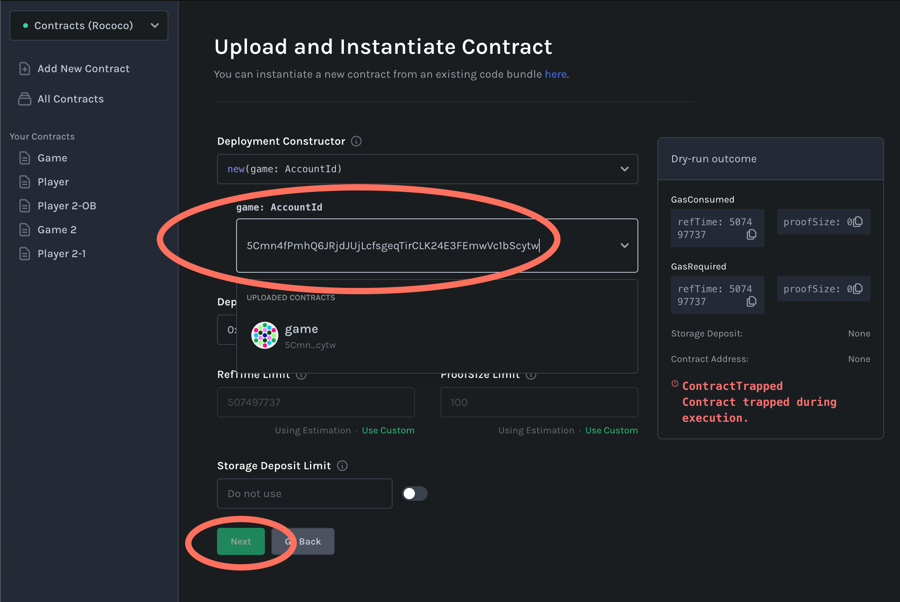
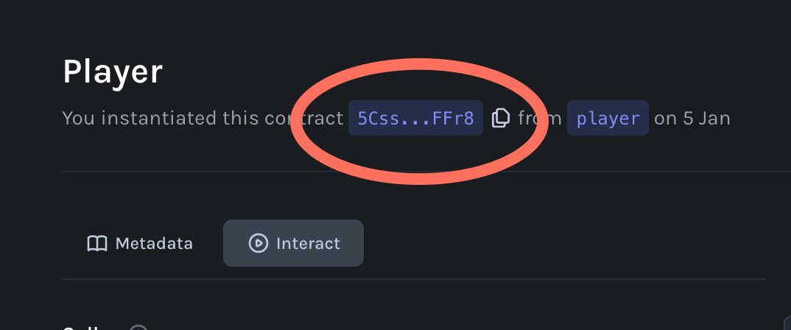
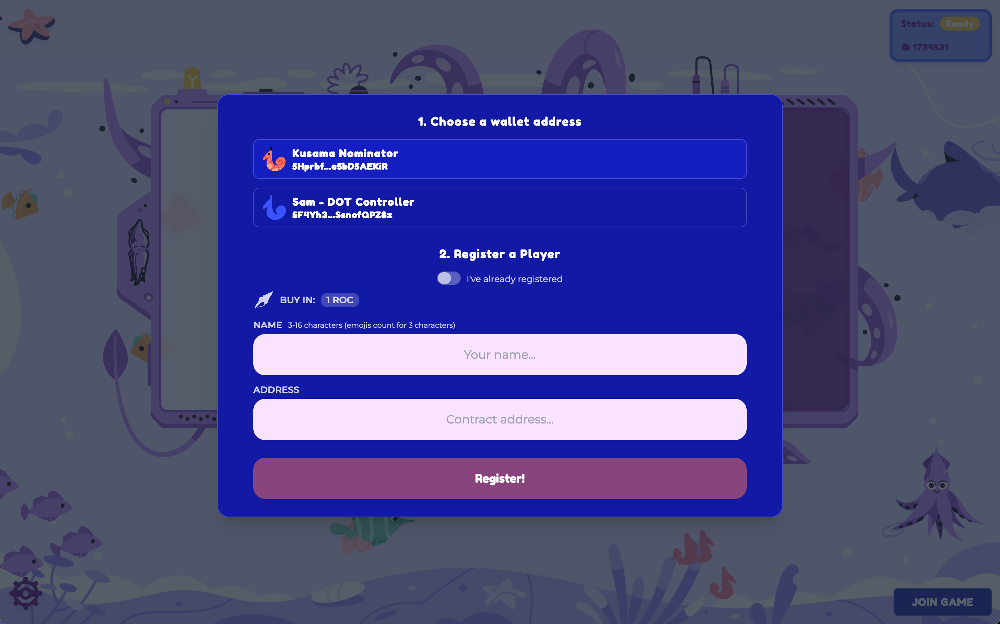
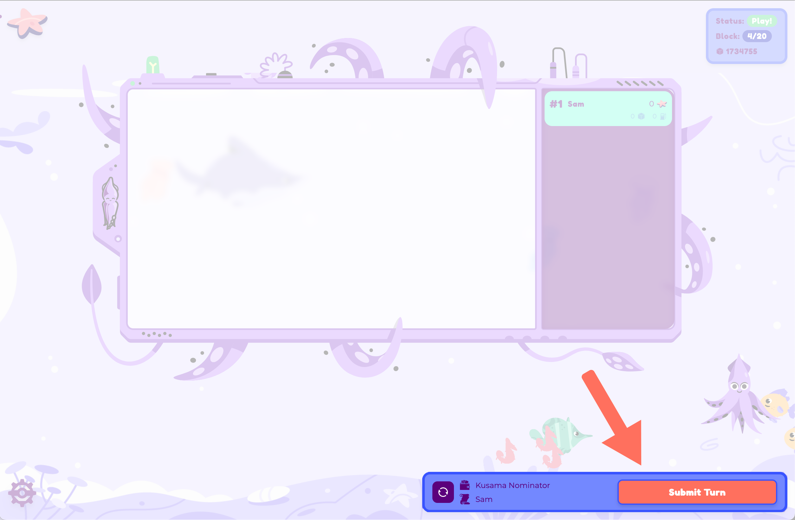

# Beginner Workshop - ink! Splash



Prerequisites: 
* Complete the [Setup Guide](https://github.com/paritytech/ink-workshop/blob/main/workshop/1_SETUP.md).

## The Game
Squink Splash is a game where participants paint as many squares on a game board as possible within a certain amount of blocks on the blockchain. Those who paint the most squares and use the least amount of gas will win.


## Compiling the Player contract

To participate you will first deploy your own smart contract called "Player", register it with the Game contract, then submit your turns. For this first round you will compile a pre-existing contract, but in a later workshop you will write your own game strategy in ink!

Open your terminal and run the following commands:

```sh
git clone --depth 1 git@github.com:paritytech/ink-workshop.git

cd beginners-workshop/basic-player/

cargo contract build --release
```

If everything compiled then this will generate a file inside of `./target/ink/player.contract`, which contains a WASM blob that you will deploy to the blockchain, and Metadata used by client applications to describe the interface of the WASM blob.

## Deploying the Player contract

Your game moderator will first deploy a Game contract and will share the public address with you. You will need this as an argument in the constructor so that your Player contract knows where to look up which fields on the game board are already painted.

Visit [contracts-ui.substrate.io](https://contracts-ui.substrate.io/add-contract):
 * Choose `Upload New Contract Code`, then `Upload Contract Bundle`.
 * Navigate to your newly compiled `player.contract` file and then click `Next`.



Voilà. You should see a contructor function with a `game` parameter. 

* Click on the dropdown, paste in the address of the deployed Game contract that the moderator shared with you, and hit `<ENTER>`.
* Click `Next`, then `Upload and Instantiate`.
* Your browser extension should pop up requesting your signature. Sign it!



If your contract was successfully deployer you should see the address on the top of the page. You will need this in a second.



## Registering the Player contract

* Visit [splash.use.ink](https://splash.use.ink) and paste in the Game address that your moderator shared with you. 
* Click on `JOIN GAME` in the bottom right
* Add your player's name ([emojis work too](https://getemoji.com/)), and add the address of your deployed Player contract.
* Click `REGISTER` and sign the transaction



## Game Start and Player Turns!

After all players have registered your moderator will start the game via a blockchain transaction. Once the game has started you will be able to submit your turn. Click `Submit Turn` on the bottom right and sign the transaction. Repeat this as many times as you can before the game is over. Good luck!

