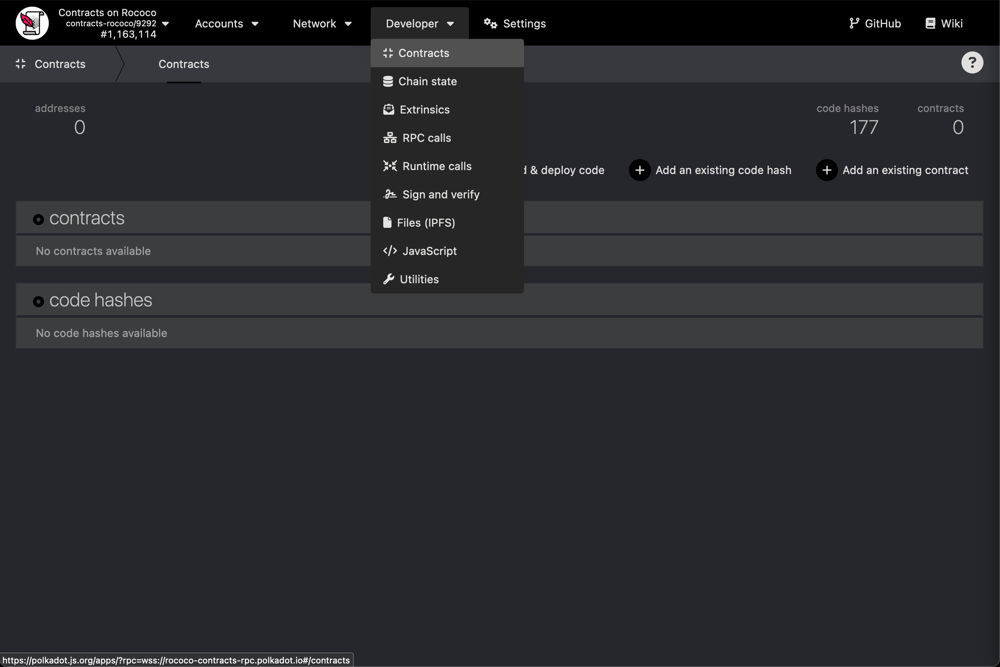
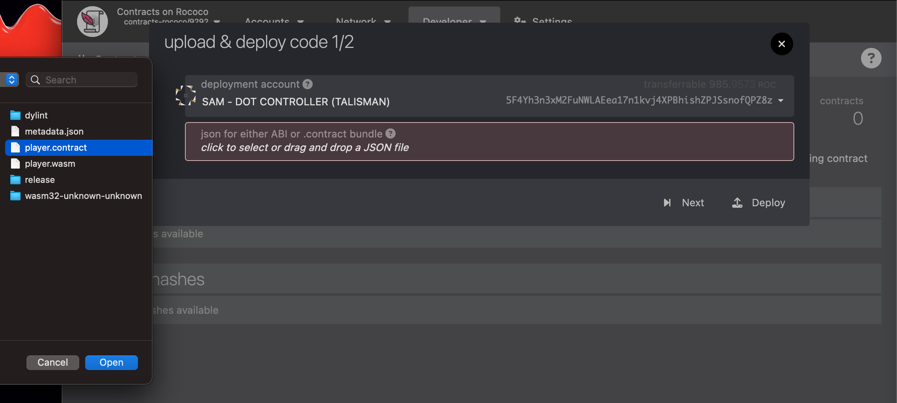

# My Favorite Sqaure

In this game you will compete against other players to paint a square on the board. We are going to start with a very simple version where you create a smart contract written in ink! and return your two favorite numbers.

1. First we must clone the game repo: 
```sh
# SSH
git clone --depth 1 git@github.com:paritytech/ink-workshop.git

#HTTPS
git clone --depth 1 https://github.com/paritytech/ink-workshop.git
```

2. Navigate to `./player/lib.rs` and edit this function to return your two favorite numbers between `0 - 9`. Watch out! squares can be overwritten by other players to steal points.

```rs
    pub fn your_turn(&mut self) -> (u32, u32) {
        // Return your favorite numbers
    }
```

3. Compile your new contract

```sh
cargo contract build
```

This will output a `./ink-workshop/player/target/ink/player.contract` file that contains the metadata and a WASM blob that we will deploy to Contracts on Rococo - a test network.

4. Visit [Contracts on Rococo](https://polkadot.js.org/apps/?rpc=wss%3A%2F%2Frococo-contracts-rpc.polkadot.io#/explorer)



5. Click on *Upload & deploy code*, then upload your `player.contract` file. CLick *Next*, then *Deploy* and sign the transaction.



6. Copy the newly created contract address. We will need this in the next step.