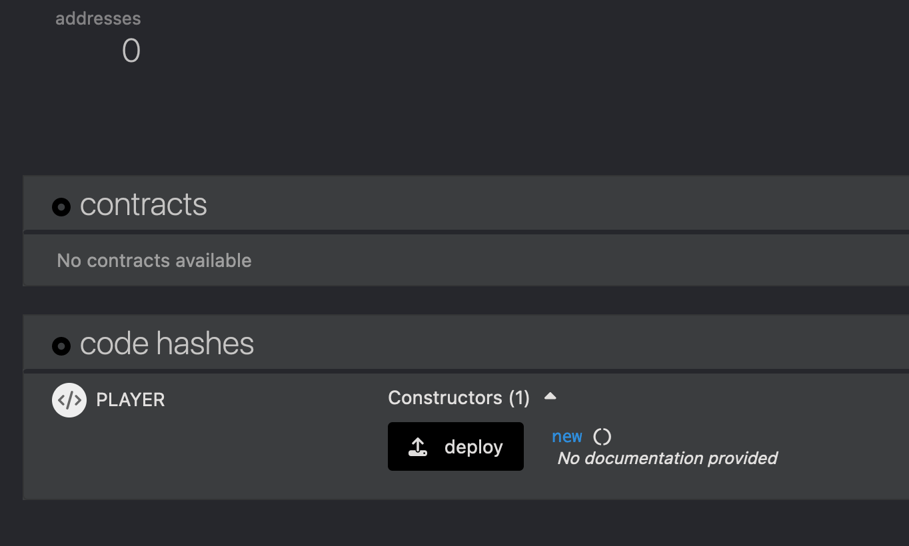
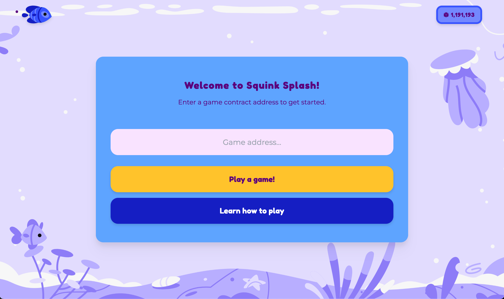

# The First Game

Let's compile our first ink! smart contract using `cargo-contract`.

1. Clone the starter code repository: 
```sh
git clone --depth 1 git@github.com:paritytech/ink-workshop.git
```

2. Navigate to `./beginners-workshop/basic-player/lib.rs` and edit `your_turn()` to return your two favorite `u32` numbers, each between `0 - 9`. 

```rs
    pub fn your_turn(&mut self) -> (u32, u32) {
        // e.g. (3, 7)
    }
```

3. Compile the contract

```sh
cargo contract build
```

This should output the following:

```sh
  - player.contract (code + metadata)
  - player.wasm (the contract's code)
  - metadata.json (the contract's metadata)
```

5. Now let's deploy our contract. This will happen in two steps. 
* Upload the contract
* Call the constructor
    
    Visit [Contracts on Rococo](https://polkadot.js.org/apps/?rpc=wss%3A%2F%2Frococo-contracts-rpc.polkadot.io#/explorer) and choose *Developer/contracts* in the tab. 
    
    *NOTE: Contracts on Rococo contains the `contracts` pallet, which enables ink! functionality*


6. Click on *Upload & deploy code*, then upload your `player.contract` file. CLick *Next*, then *Deploy* and sign the transaction.


7. Great! We just uploaded our WASM blob and the application binary interface (ABI). Now let's call the constructor, and sign the message.



8. At this point there is an instance of our contract on chain. All contract instances contain a public address (AccountId). Copy the address. We will need this in the next step.

9. Go to the [Game Board](https://splash.use.ink). The Game Master will provide you with the game contract address. Enter this in to the input field and click *Play a game!*.

