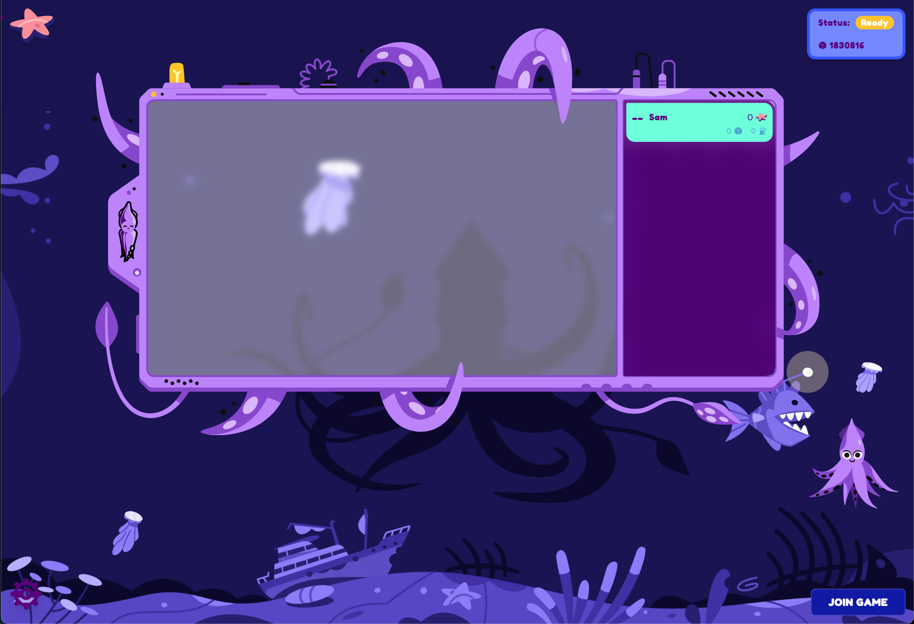

# Advanced Workshop - ink! Splash



## Workshop Goals
After this workshop you will know how to:
* Call another ink! contract

## Prerequisites
* Complete the [Setup Guide](https://github.com/paritytech/ink-workshop/blob/main/workshop/1_SETUP.md).
* Complete the [Beginner Workshop](https://github.com/paritytech/ink-workshop/blob/main/workshop/2_BEGINNER_WORKSHOP.md).
* Clone the repo:
```sh
git clone --depth 1 git@github.com:paritytech/ink-workshop.git
```

## An Advanced Game
In this game you will write Rust code to return different `(x, y)` coordinates on each transaction. Collisions with other players are not allowed, so it will be important to check if a square on the game board is already taken. We will need to call the Game contract to do this. If the square is taken, then we need to try new coordinates. It will be your job to write the best algorithm that uses the least amount of gas.


## An Advanced Player Contract

We are going to use a new pre-existing Player contract, but you will add your own logic for each turn.

Before we start coding, let's learn about how to call another contract.

### THE CODE

```rs
#[ink::contract]
mod player {
    // 1. We first import the game struct Field, and a reference to the Game contract called "SquinkSplashRef"
    use game::{Field, SquinkSplashRef};

    impl Player {
        #[ink(constructor)]
        pub fn new(game: AccountId) -> Self {

            // 2. We set the game variable using the address
            let game = SquinkSplashRef::from_account_id(game);
            Self {
                dimensions: game.dimensions(),
                seed: Self::env().block_number(),
                game,
            }
        }

        pub fn your_turn(&mut self) -> Field {
            let turn = Field {
                x: 5 // your logic can change this value on each turn,
                y: 5 // your logic can change this value on each turn,
            }
            // 3. We call the method field() defined here -> https://github.com/paritytech/ink-workshop/blob/main/game/lib.rs#L455
            if self.game.field(turn).is_none() {
                return field;
            }

            Field { x: 0, y: 0 } // or some other logic...
        }
    }
}
```

### DEPENDENCIES in both cargo.toml files
We need this in `game/cargo.toml` to tell ink! to compile Game as a dependency
```toml
// Inside of game/cargo.toml
ink-as-dependency = []
```


We need this in `advanced-workshop/player/cargo.toml` to tell the compiler to use the Game
```toml
[dependencies]
game = { package = "squink_splash", path = "../../game", default-features = false, features = ["ink-as-dependency"] }
```

## Create Your Player

Now it is your turn. The reference to the Game contract is already set up for you here. Open this file in your IDE.

```sh
./advanced-workshop/player/lib.rs
```

1. Update the method `your_turn` so that it returns different coordinates on each block, and checks to see if the square on the game board if vacant.
    * `self.dimensions.x` and `self.dimensions.y` are already available in the Player contract. Use these to make sure that you stay in bounds.
    * TIP: you can use `self.env().block_number()` to retrieve the current block.
    * TIP: You can add a storage element to the Player struct, but be aware that this uses more gas per transaction

2. COMPILE: Compile the contract:

```sh
# Inside of ./beginners-workshop/basic-player/
cargo contract build --release
```
This will generate the file `./target/ink/player.contract`, which contains a WASM blob (deployed to the blockchain) and Metadata (used for client applications) that you will use to deploy next.

## Deploying the Player contract

1. Visit [contracts-ui.substrate.io](https://contracts-ui.substrate.io/add-contract):
2. Choose `Upload New Contract Code`, then `Upload Contract Bundle`.
3. Navigate to your newly compiled `player.contract` file and then click `Next`.


You should see a contructor function with a `game` parameter. Ask your Moderator for the Game address so that your player contract calls the correct game contract.

4. Click on the dropdown, paste in the address of the deployed Game contract that the moderator shared with you, and hit `<ENTER>`.
5. Click `Next`, then `Upload and Instantiate`.
6. Your browser extension should pop up requesting your signature. Sign it!


If your contract was successfully deployer you should see the address on the top of the page. You will need this in a second.


## Joining the Game

1. Visit [splash.use.ink](https://splash.use.ink) and paste in the Game address that your moderator shared with you.
2. Click on `JOIN GAME` in the bottom right
3. Add your player's name ([emojis are allowed 🦑](https://getemoji.com/)), and add the address of your deployed Player contract.
4. Click `REGISTER` and sign the transaction


## Game Start and Player Turns!

After all players have registered your moderator will start the game via a blockchain transaction. Once the game has started you will be able to submit your turn. 

1. Click `Submit Turn` on the bottom right 
2. Sign the transaction.
3. Repeat as many times as possible before the game ends


## 🍀 Good luck!

If you enjoyed this workshop, you can find more ink! tutorials on the [ink! website](https://use.ink/) and on the [substrate website](https://docs.substrate.io/tutorials/)